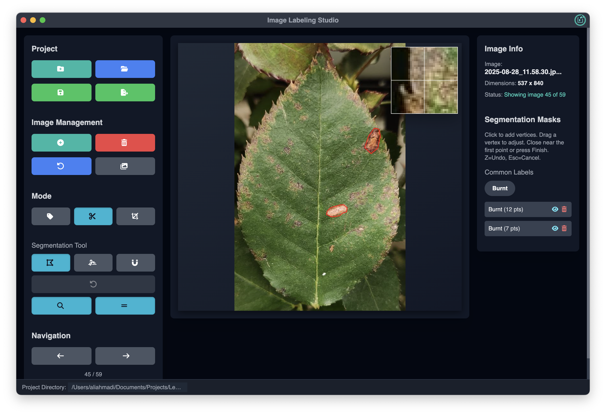

# Image Labeling Studio



**Image Labeling Studio** is a cross-platform desktop application built with [Electron](https://www.electronjs.org/) and [TailwindCSS](https://tailwindcss.com/).
It allows you to efficiently manage, label, crop, and segment images for machine learning datasets or computer vision projects.

---

## ✨ Features

* 📂 **Project Management**

  * Create, save, and load labeling projects.
  * Projects store images, annotations, and metadata in a selected directory.

* 🖼 **Image Management**

  * Add or remove multiple images.
  * Batch import with progress tracking.

* 🏷 **Modes**

  * **Classification** → Assign labels to images.
  * **Segmentation** → Polygon & freehand tools for creating segmentation masks.
  * **Cropping** → Crop images with snapping, aspect lock, and rule-of-thirds grid.

* 🔄 **Navigation**

  * Easily move between images with arrow keys or navigation buttons.
  * View and search all images in a project.

* 💾 **Data Export**

  * Save projects anytime.
  * Export annotations in JSON format.

---

## 🚀 Installation

### Prerequisites

* [Node.js](https://nodejs.org/) (v18+)
* [npm](https://www.npmjs.com/)

### Clone & Setup

```bash
git clone https://github.com/your-username/image-labeling-studio.git
cd image-labeling-studio
npm install
```

### Run in Development

```bash
npm start
```

### Build Distributable (AppImage, DMG, EXE, etc.)

```bash
npm run dist
```


## 📬 Contact

**Ali Ahmadi Esfidi**

📧 Email: [mr-ahmadi2004@outlook.com](mailto:mr-ahmadi2004@outlook.com)

